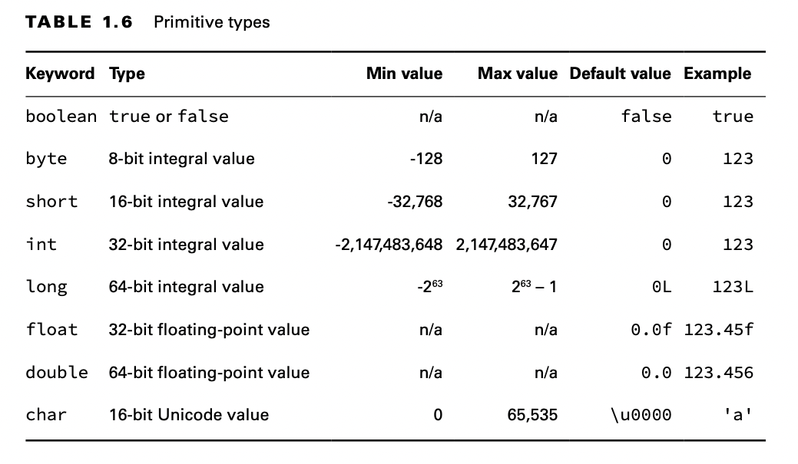
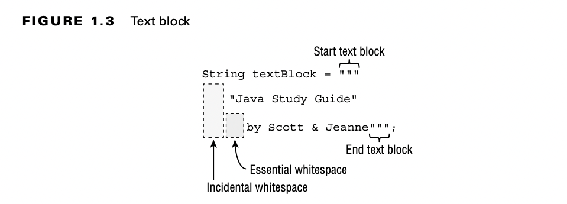

# Understanding Data Types

Java applications contain two types of data: primitive types and reference types.

## Using Primitive Types

Java has eight built-in data types, referred to as the Java primitive types.
A primitive is just a single value in memory, such as a number or character.

### The Primitive Types

The exam assumes you are well versed in the eight primitive data types, their relative sizes, and what can be stored in
them.



**Is String a Primitive?**

No, it is not.That said, String is often mistaken for a ninth primitive because Java includes built-in support for
String literals and operators.

There’s a lot of information in Table 1.6. Let’s look at some key points:

- The byte, short, int, and long types are used for integer values without decimal points.
- Each numeric type uses twice as many bits as the smaller similar type. For example, short uses twice as many bits as
  byte does.
- All of the numeric types are signed and reserve one of their bits to cover a negative range. For example, instead of
  byte covering 0 to 255 (or even 1 to 256) it actually covers -128 to 127.
- A float requires the letter f or F following the number so Java knows it is a float. Without an f or F, Java
  interprets a decimal value as a double.
- A long requires the letter l or L following the number so Java knows it is a long. Without an l or L, Java interprets
  a number without a decimal point as an int in most scenarios.

**Signed and Unsigned: short and char**

For the exam, you should be aware that short and char are closely related, as both are stored as integral types with the
same 16-bit length.The primary difference is that short is signed, which means it splits its range across the positive
and negative integers. Alternatively, char is unsigned, which means its range is strictly positive, including 0.

For the exam, you should be aware that short and char are closely related, as both are stored as integral types with the
same 16-bit length.The primary difference is that short is signed, which means it splits its range across the positive
and negative integers. Alternatively, char is unsigned, which means its range is strictly positive, including 0.

### Writing Literals

When a number is present in the code, it is called a literal. By default, Java assumes you are defining an int value
with a numeric literal.

```
long max = 3123456789; // DOES NOT COMPILE
long max = 3123456789L; // Now Java knows it is a long
```

- Octal (digits 0–7), which uses the number 0 as a prefix—for example, 017.
- Hexadecimal (digits 0–9 and letters A–F/a–f), which uses 0x or 0X as a prefix—for example, 0xFF, 0xff, 0XFf.
  Hexadecimal is case insensitive, so all of these examples mean the same value.
- Binary (digits 0–1), which uses the number 0 followed by b or B as a prefix—for example, 0b10, 0B10.

### Literals and the Underscore Character

You can have underscores in numbers to make them easier to read:

```
int million1 = 1000000;
int million1 = 1_000_000;
```

You can add underscores anywhere except at the beginning of a literal, the end of a literal, right before a decimal
point, or right after a decimal point.

```
double notAtStart = _1000 .00; // DOES NOT COMPILE
double notAtEnd = 1000.00_; // DOES NOT COMPILE
double notByDecimal = 1000_.00; // DOES NOT COMPILE
double annoyingButLegal = 1_00_0.0_0;  // Ugly, but compiles
double reallyUgly = 1__________2; //Also compiles
```

## Using Reference Types

A reference type refers to an object (an instance of a class). Unlike primitive types that hold their values in the
memory where the variable is allocated, references do not hold the value of the object they refer to.

## Distinguishing between Primitives and ReferenceTypes

First, notice that all the primitive types have lowercase type names. All classes that come with Java begin with
uppercase. Although not required, it is a standard practice, and you should follow this convention for classes you
create as well.

Next, reference types can be used to call methods, assuming the reference is not null. Primitives do not have methods
declared on them.

    String reference = "hello";
    int len = reference.length();
    int bad = len.length(); // DOES NOT COMPILE

Finally, reference types can be assigned null, which means they do not currently refer to an object. Primitive types
will give you a compiler error if you attempt to assign them null.

    int value = null; // DOES NOT COMPILE 
    String name = null;

## Creating Wrapper Classes

Each primitive type has a wrapper class, which is an object type that corresponds to the primitive.

| Primitive type | Wrapper Class | Wrappper class inherits Number? | Example of creating         |
| ---------------- | --------------- | --------------------------------- | ----------------------------- |
| boolean        | Boolean       | No                              | Boolean.valueOf(true)       |
| byte           | Byte          | Yes                             | Byte.valueOf((byte) 1)      |
| short          | Short         | Yes                             | Short.valueOf((byte) 1)     |
| int            | Integer       | Yes                             | Integer.valueOf((byte) 1)   |
| long           | Long          | Yes                             | Long.valueOf((byte) 1)      |
| float          | Float         | Yes                             | Float.valueOf((byte) 1)     |
| double         | Double        | Yes                             | Double.valueOf((byte) 1)    |
| char           | Character     | No                              | Character.valueOf((byte) 1) |

There is also a valueOf() variant that converts a String into the wrapper class. For example:

```
  int primitive = Integer.parseInt("123"); 
  Integer wrapper = Integer.valueOf("123");
  
  Double apple = Double.valueOf("200.99"); 
  System.out.println(apple.byteValue()); // -56 
  System.out.println(apple.intValue()); // 200 
  System.out.println(apple.doubleValue()); // 200.99
```

## Defining Text Blocks

The syntax \" lets you say you want a " rather than to end the String, and \n says you want a new line.
Both of these are called escape characters because the backslash provides a special meaning.

```
String eyeTest = "\"Java Study Guide\"\n by Scott & Jeanne";
```



While this does work, it is hard to read. Luckily, Java has text blocks, also known as multiline strings.

A text block starts and ends with three double quotes ("""), and the contents don’t need to be escaped.

Essential whitespace is part of your String and is important to you. Incidental whitespace just happens to be there to
make the code easier to read. You can reformat your code and change the amount of incidental whitespace without any
impact on your String value.

Imagine a vertical line drawn on the leftmost non-whitespace character in your text block. Everything to the left of it
is incidental whitespace, and everything to the right is essential whitespace.

| Formatting             | Meaning in regular String                                                   | Meaning in text block      |
| ------------------------ | ----------------------------------------------------------------------------- | ---------------------------- |
| \\"                    | "                                                                           | "                          |
| \\"""                  | n/a – Invalid                                                              | """                        |
| \"\"\"                 | """                                                                         | """                        |
| Space (at end of line) | Two spaces (\s is a space and preserves<br/><br/>leading space on the line) | Two spaces                 |
| \ (at end of line)     | n/a – Invalid                                                              | Omit new line on that line |

```
String block = """doe"""; // DOES NOT COMPILE
```

Text blocks require a line break after the opening """, making this one invalid.

How many lines do you think are in this text block?

```
String block = """
    doe \ 
    deer""";
```

Just one. The output is doe deer since the \ tells Java not to add a new line before deer.

```
String block = """
  doe \n 
  deer """;

```

Since the text block has the closing """ on a separate line, we have three lines for the lines in the text block plus
the explicit \n.

```
String block = """
"doe\"\"\"
\"deer\"""
""";
System.out.print("*"+ block + "*");

```

All of the \" escape the ". There is one space of essential whitespace on the doe and deer lines. All the other leading
whitespace is incidental whitespace.
