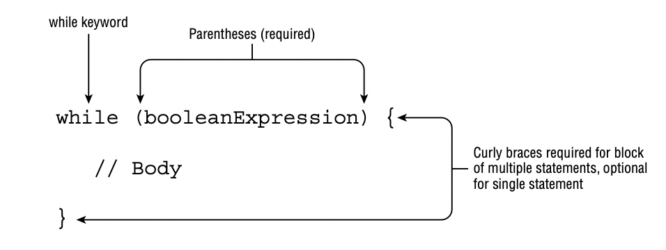

# Writing while Loops

A loop is a repetitive control structure that can execute a statement of code multiple times in succession.
By using variables that can be assigned new values, each repetition of the statement may be different.

    int counter = 0;
    while (counter < 10) {
        double price = counter * 10;
        System.out.println(price);
        counter++;
    }

## The while Statement

The simplest repetitive control structure in Java is the while statement.
Like all repetition control structures, it has a termination condition, implemented as a boolean expression, that will
continue as long as the expression evaluates to true.

    int roomInBelly = 5;

    public void eatCheese(int bitesOfCheese) {
        while (bitesOfCheese > 0 && roomInBelly > 0) {
            bitesOfCheese--;
            roomInBelly--;
        }
        System.out.println(bitesOfCheese + " pieces of cheese left");
    }

One thing to remember is that a while loop may terminate after its first evaluation of the boolean expression. For
example, how many times is Not full! printed in the following example?

    int full = 5;
    while (full < 5) {
        System.out.println("Not full!");
        full++;
    }

The answer? Zero! On the first iteration of the loop, the condition is reached, and the loop exits.

## The do/while Statement

The second form a while loop can take is called a do/while loop, which, like a while loop, is a repetition control
structure with a termination condition and statement, or a block of statements.

Unlike a while loop, though, a do/while loop guarantees that the statement or block will be executed at least once.

    int lizard = 0;
    do {
        lizard++;
    } while (false);
    System.out.println(lizard); // 1

## Infinite Loops

The single most important thing you should be aware of when you are using any repetition control structures is to make
sure they always terminate! Failure to terminate a loop can lead to numerous problems in practice, including overflow
exceptions, memory leaks, slow performance, and even bad data.

    int pen = 2;
    int pigs = 5;
    while (pen < 10)
        pigs++;

You may notice one glaring problem with this statement: it will never end. The variable pen is never modified, so the
expression (pen < 10) will always evaluate to true. The result is that the loop will never end, creating what is
commonly referred to as an infinite loop.

An infinite loop is a loop whose termination condition is never reached during runtime.
