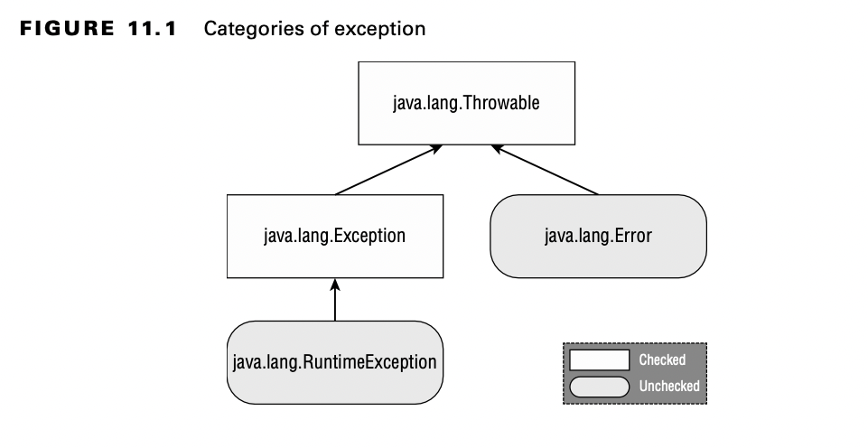
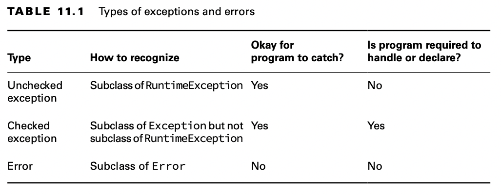

# Understanding Exceptions

A program can fail for just about any reason. Here are just a few possibilities:

- The code tries to connect to a website, but the Internet connection is down.
- You made a coding mistake and tried to access an invalid index in an array.
- One method calls another with a value that the method doesn’t support.

## The Role of Exceptions

An exception is Java’s way of saying, “I give up. I don’t know what to do right now. You deal with it.” When you write a
method, you can either deal with the exception or make it the calling code’s problem.

## Understanding Exception Types

An exception is an event that alters program flow. Java has a Throwable class for all objects that represent these
events.

### Checked Exceptions

A checked exception is an exception that must be declared or handled by the application code where it is thrown. In
Java, checked exceptions all inherit Exception but not RuntimeException.

Checked exceptions also include any class that inherits Throwable but not Error or RuntimeException, such as a class
that directly extends Throwable. For the exam, you just need to know about checked exceptions that extend Exception.

Java has a rule called the handle or declare rule. The handle or declare rule means that all checked exceptions that
could be thrown within a method are either wrapped in compatible try and catch blocks or declared in the method
signature.

The following fall() method declares that it might throw an IOException, which is a checked exception:

    void fall(int distance) throws IOException {
        if (distance > 10) {
            throw new IOException();
        }
    }

The **throw** keyword tells Java that you want to throw an Exception, while the **throws** keyword simply declares that
the method might throw an Exception. It also might not.

The following alternate version of the fall() method handles the exception:

    void fallHandle(int distance) {
        try {
            if (distance > 10) {
                throw new IOException();
            }
        } catch (Exception e) {
            e.printStackTrace();
        }
    }

### Unchecked Exceptions

An unchecked exception is any exception that does not need to be declared or handled by the application code where it is
thrown. Unchecked exceptions are often referred to as runtime exceptions, although in Java, unchecked exceptions include
any class that inherits RuntimeException or Error.

It is permissible to handle or declare an unchecked exception. That said, it is better to document the unchecked
exceptions callers should know about in a Javadoc comment rather than declaring an unchecked exception.

An unchecked exception can occur on nearly any line of code, as it is not required to be handled or declared. For
example, a NullPointerException can be thrown in the body of the following method if the input reference is null:

    void fall(String input) { 
        System.out.println(input.toLowerCase());
    }

### Error and Throwable

Error means something went so horribly wrong that your program should not attempt to recover from it. For example, the
disk drive “disappeared” or the program ran out of memory. These are abnormal conditions that you aren’t likely to
encounter and cannot recover from.

For the exam, the only thing you need to know about Throwable is that it’s the parent class of all exceptions, including
the Error class.

### Reviewing Exception Types

For the exam, remember that a Throwable is either an Exception or an Error. You should not catch Throwable directly in
your code.

## Throwing an Exception

Any Java code can throw an exception; this includes code you write. Some exceptions are provided with Java. You might
encounter an exception that was made up for the exam. This is fine. The question will make it obvious that this is an
exception by having the class name end with Exception.

Here’s an example:

    String[] animals = new String[0];
    System.out.println(animals[0]); // ArrayIndexOutOfBoundsException

On the exam, some questions have a choice about not compiling and about throwing an exception. Pay special attention to
code that calls a method on a null reference or that references an invalid array or List index. If you spot this, you
know the correct answer is that the code throws an exception at runtime.

The second way for code to result in an exception is to explicitly request Java to throw one. Java lets you write
statements like these:

    throw new Exception();
    throw new Exception("Ow! I fell.");
    throw new RuntimeException();
    throw new RuntimeException("Ow! I fell.");

The throw keyword tells Java that you want some other part of the code to deal with the exception.

**throw vs. throws**

Anytime you see throw or throws on the exam, make sure the correct one is being used. The throw keyword is used as a
statement inside a code block to throw a new exception or rethrow an existing exception, while the throws keyword is
used only at the end of a method declaration to indicate what exceptions it supports.

When creating an exception, you can usually pass a String parameter with a message, or you can pass no parameters and
use the defaults. We say usually because this is a convention.

Additionally, you should know that an Exception is an Object. This means you can store it in an object reference, and
this is legal:

    var e = new RuntimeException(); 
    throw e;

The exam might also try to trick you. Do you see why this code doesn’t compile?

    throw RuntimeException(); // DOES NOT COMPILE

If your answer is that there is a missing keyword, you’re absolutely right. The exception is never instantiated with the
new keyword.

Can you see why the following does not compile?

    try {
        throw new RuntimeException();
        throw new ArrayIndexOutOfBoundsException(); // DOES NOT COMPILE
    } catch (Exception e) {}

The compiler recognizes this and reports an unreachable code error.

## Calling Methods That Throw Exceptions

When you’re calling a method that throws an exception, the rules are the same as within a method. Do you see why the
following doesn’t compile?

    class NoMoreCarrotsException extends Exception {}

    public class Bunny {
        public static void main(String[] args) {
            eatCarrot(); // DOES NOT COMPILE 
        }
        private static void eatCarrot() throws NoMoreCarrotsException {} 
    }

The problem is that NoMoreCarrotsException is a checked exception. Checked exceptions must be handled or declared. The
code would compile if you changed the main() method to either of these:

    public static void main(String[] args) throws NoMoreCarrotsException { 
        eatCarrot();
    }

    public static void main(String[] args) { 
        try {
            eatCarrot();
            } 
        catch (NoMoreCarrotsException e) {
            System.out.print("sad rabbit"); 
        }
    }

You might have noticed that eatCarrot() didn’t throw an exception; it just declared that it could. This is enough for
the compiler to require the caller to handle or declare the exception.

The compiler is still on the lookout for unreachable code. Declaring an unused exception isn’t considered unreachable
code. It gives the method the option to change the implementation to throw that exception in the future.

    public void bad() {
        try {
            eatCarrot();
        } catch (NoMoreCarrotsException e) { // DOES NOT COMPILE
            System.out.print("sad rabbit");
        }
    }

    private static void eatCarrot() { }

Java knows that eatCarrot() can’t throw a checked exception—which means there’s no way for the catch block in bad() to
be reached.

When you see a checked exception declared inside a catch block on the exam, make sure the code in the associated try
block is capable of throwing the exception or a subclass of the exception. If not, the code is unreachable and does not
compile. Remember that this rule does not extend to unchecked exceptions or exceptions declared in a method signature.

## Overriding Methods with Exceptions

An overridden method may not declare any new or broader checked exceptions than the method it inherits. For example,
this code isn’t allowed:

    class CanNotHopException extends Exception {}

    class Hopper {
        public void hop() {}
    }

    class Bunny extends Hopper {
        public void hop() throws CanNotHopException {} // DOES NOT COMPILE
    }

Java knows hop() isn’t allowed to throw any checked exceptions because the hop() method in the superclass Hopper doesn’t
declare any.

An overridden method in a subclass is allowed to declare fewer exceptions than the superclass or interface.

## Printing an Exception

There are three ways to print an exception. You can let Java print it out, print just the message, or print where the
stack trace comes from. 

    public static void main(String[] args) {
        try {
            hop();
        } catch (Exception e) {
            System.out.println(e + "\n");
            System.out.println(e.getMessage() + "\n");
            e.printStackTrace();
        }
    }

    private static void hop() {
        throw new RuntimeException("cannot hop");
    }
