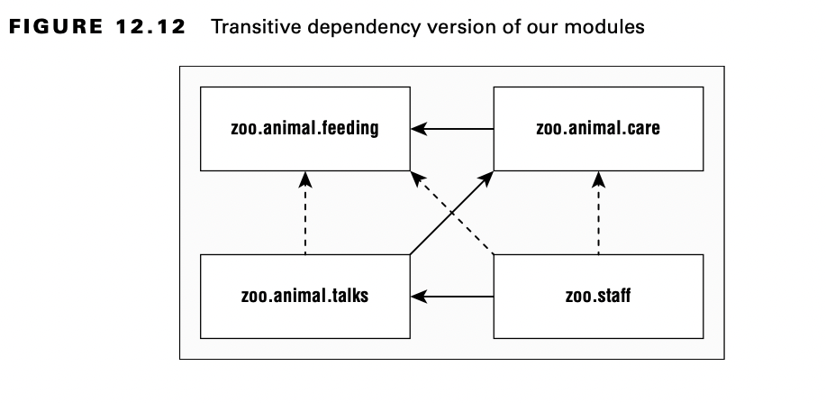

# Diving into the Module Declaration

## Exporting a Package

We’ve already seen how **exports packageName** exports a package to other modules. It’s also possible to export a
package to
a specific module. Suppose the zoo decides that only staff members should have access to the talks. We could update the
module declaration as follows:

    module zoo.animal.talks {
        exports zoo.animal.talks.content to zoo.staff;
        exports zoo.animal.talks.media;
        exports zoo.animal.talks.schedule;
        requires zoo.animal.feeding;
        requires zoo.animal.care;
    }

**Exported Types**

We’ve been talking about exporting a package. But what does that mean, exactly? All public classes, interfaces, enums,
and records are exported. Further, any public and protected fields and methods in those files are visible.

Fields and methods that are private are not visible because they are not accessible outside the class. Similarly,
package fields and methods are not visible because they are not accessible outside the package.

## Requiring a Module Transitively

As you saw earlier in this chapter, requires moduleName specifies that the current module depends on moduleName. There’s
also a **requires** transitive moduleName, which means that any module that requires this module will also depend on
moduleName.

For example, zoo.animal.talks depends on zoo.animal.care, which depends on zoo.animal.feeding. That means the arrow
between zoo.animal.talks and zoo.animal.feeding no longer appears in Figure 12.12.

Now let’s look at the four module declarations. The first module remains unchanged. We are exporting one package to any
packages that use the module.

    module zoo.animal.feeding { 
        exports zoo.animal.feeding;
    }

The zoo.animal.care module is the first opportunity to improve things. Rather than forcing all remaining modules to
explicitly specify zoo.animal.feeding, the code uses requires transitive.

    module zoo.animal.care {
        exports zoo.animal.care.medical;
        requires transitive zoo.animal.feeding;
    }

In the zoo.animal.talks module, we make a similar change and don’t force other modules to specify zoo.animal.care. We
also no longer need to specify zoo.animal.feeding, so that line is commented out.

    module zoo.animal.talks {
        exports zoo.animal.talks.content to zoo.staff; 
        exports zoo.animal.talks.media;
        exports zoo.animal.talks.schedule;
        // no longer needed requires zoo.animal.feeding;
        // no longer needed requires zoo.animal.care;
        requires transitive zoo.animal.care;
    }

Finally, in the zoo.staff module, we can get rid of two requires statements.

    module zoo.staff {
    // no longer needed requires zoo.animal.feeding;
    // no longer needed requires zoo.animal.care;
    requires zoo.animal.talks;
    }

The more modules you have, the greater the benefits of the requires transitive compound. It is also more convenient for
the caller. If you were trying to work with this zoo, you could just require zoo.staff and have the remaining
dependencies automatically inferred.

### Effects of requires transitive

Given our new module declarations, and using Figure 12.12, what is the effect of applying the transitive modifier to the
**requires** statement in our zoo.animal.care module? Applying the transitive modifiers has the following effects:

- Module zoo.animal.talks can optionally declare that it requires the zoo.animal.feeding module, but it is not required.
- Module zoo.animal.care cannot be compiled or executed without access to the zoo.animal.feeding module.
- Module zoo.animal.talks cannot be compiled or executed without access to the zoo.animal.feeding module.

These rules hold even if the zoo.animal.care and zoo.animal.talks modules do not explicitly reference any packages in
the zoo.animal.feeding module. On the other hand, without the transitive modifier in our module declaration of
zoo.animal.care, the other modules would have to explicitly use requires in order to reference any packages in the
zoo.animal.feeding module.

### Duplicate requires Statements

One place the exam might try to trick you is mixing requires and requires transitive. Can you think of a reason this
code doesn’t compile?

    module bad.module {
        requires zoo.animal.talks;
        requires transitive zoo.animal.talks;
    }

Java doesn’t allow you to repeat the same module in a **requires** clause. It is redundant and most likely an error in
coding. Keep in mind that requires transitive is like requires plus some extra behavior.

## Opening a Package

Java allows callers to inspect and call code at runtime with a technique called reflection. This is a powerful approach
that allows calling code that might not be available at compile time. It can even be used to subvert access control!
Don’t worry—you don’t need to know how to write code using reflection for the exam.

The **opens** directive is used to enable reflection of a package within a module. You only need to be aware that the
opens
directive exists rather than understanding it in detail for the exam.

Since reflection can be dangerous, the module system requires developers to explicitly allow reflection in the module
declaration if they want calling modules to be allowed to use it. The following shows how to enable reflection for two
packages in the zoo.animal.talks module:

    module zoo.animal.talks {
        opens zoo.animal.talks.schedule;
        opens zoo.animal.talks.media to zoo.staff;
    }

The first example allows any module using this one to use reflection. The second example only gives that privilege to
the zoo.staff module. There are two more directives you need to know for the exam—provides and uses—which are covered in
the following section.

**Opening an Entire Module**

In the previous example, we opened two packages in the zoo.animal.talks module, but suppose we instead wanted to open
all packages for reflection. No problem. We can use the open module modifier, rather than the opens directive (notice
the s difference):

    open module zoo.animal.talks {
    }

With this module modifier, Java knows we want all the packages in the module to be open. What happens if you apply both
together?

    open module zoo.animal.talks {
        opens zoo.animal.talks.schedule; // DOES NOT COMPILE
    }

This does not compile because a modifier that uses the open modifier is not permitted to use the opens directive. After
all, the packages are already open!
