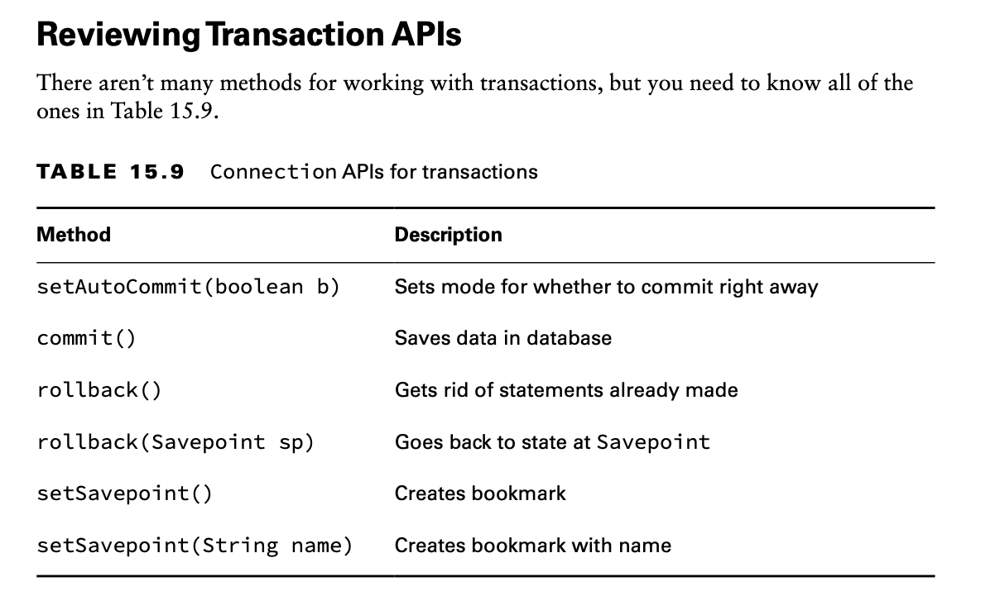

# Controlling Data with Transactions

Until now, any changes we made to the database took effect right away. A commit is like saving a file. On the exam,
changes commit automatically unless otherwise specified. How- ever, you can change this behavior to control commits
yourself.

A transaction is when one or more statements are grouped with the final results committed or rolled back. Rollback is
like closing a file without saving. All the changes from the start of the transaction are discarded.

## Committing and Rolling Back

Our zoo is renovating and has decided to give more space to the elephants. However, we only have so much space, so the
zebra exhibit will need to be made smaller. Since we can’t invent space out of thin air, we want to ensure that the
total amount of space remains the same. If either adding space for the elephants or removing space for the zebras fails,
we want our transaction to roll back. In the interest of simplicity, we assume that the database table is in a valid
state before we run this code. Now, let’s examine the code for this scenario:

        public static void main(String[] args) throws SQLException {

        try (Connection conn =
                     DriverManager.getConnection("jdbc:hsqldb:file:zoo")) {
            conn.setAutoCommit(false);
            var elephantRowsUpdated = updateRow(conn, 5, "African Elephant");
            var zebraRowsUpdated = updateRow(conn, -5, "Zebra");
            if (!elephantRowsUpdated || !zebraRowsUpdated)
                conn.rollback();
            else {
                String selectSql = """
                        SELECT COUNT(*)
                        FROM exhibits
                        WHERE num_acres <= 0""";

                try (PreparedStatement ps = conn.prepareStatement(selectSql); ResultSet rs = ps.executeQuery()) {
                    rs.next();
                    int count = rs.getInt(1);
                    if (count == 0)
                        conn.commit();
                    else
                        conn.rollback();
                }
            }
        }
    }

    private static boolean updateRow(Connection conn, int numToAdd, String name)
            throws SQLException {
        String updateSql = """
                UPDATE exhibits
                SET num_acres = num_acres + ? WHERE name = ?""";
        try (PreparedStatement ps = conn.prepareStatement(updateSql)) {
            ps.setInt(1, numToAdd);
            ps.setString(2, name);
            return ps.executeUpdate() > 0;
        }
    }

The first interesting thing in this example , where we turn off autocommit mode and declare that we will handle
transactions ourselves. Most databases support disabling autocommit mode. If a database does not, it will throw
a SQLException.

**Autocommit Edge Cases**

You need to know two edge cases for the exam. First, calling setAutoCommit(true) will automatically trigger a commit
when you are not already in autocommit mode. After that, autocommit mode takes effect, and each statement is
automatically committed.

The other edge case is what happens if you have autocommit set to false and close your connection without rolling back
or committing your changes.The answer is that the behavior is undefined. It may commit or roll back, depending solely on
the driver. Don’t depend on this behavior; remember to commit or roll back at the end of a transaction!

## Bookmarking with Savepoints

So far, we have rolled back to the point where autocommit was turned off. You can use save- points to have more control
of the rollback point. Consider the following example:

    conn.setAutoCommit(false);
    Savepoint sp1 = conn.setSavepoint();
    // database code
    Savepoint sp2 = conn.setSavepoint("second savepoint"); 24: // database code
    conn.rollback(sp2);
    // database code
    conn.rollback(sp1);

You can only use savepoints when you are controlling the transaction. The name is optional and typically included in the
toString() if you print the savepoint reference.

Order matters. If we reversed lines the code would throw an exception.

## Reviewing Transaction APIs

